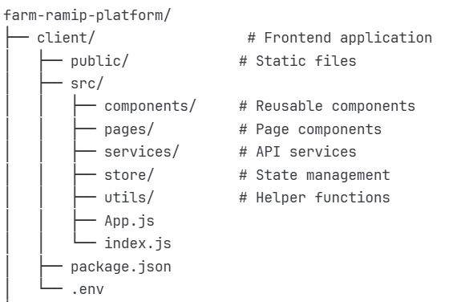
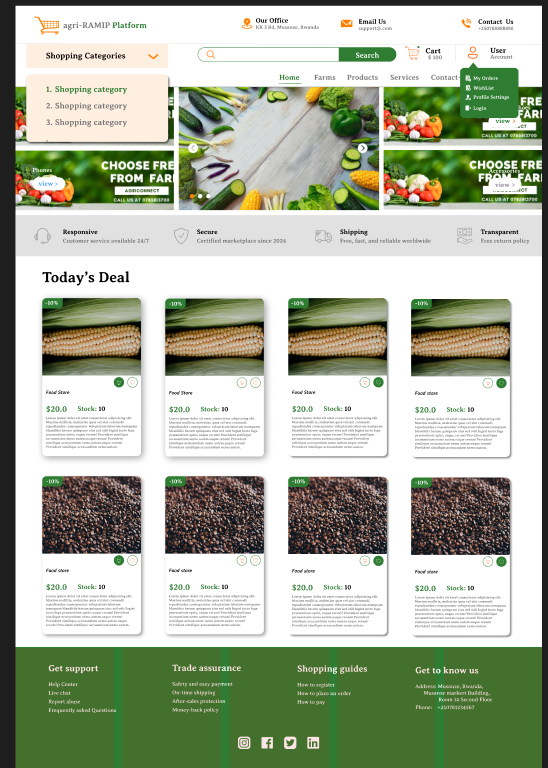
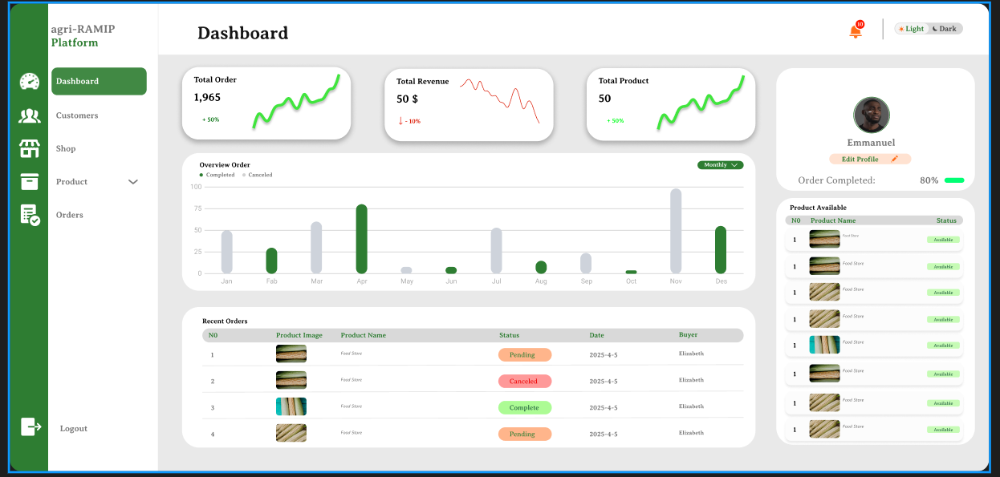
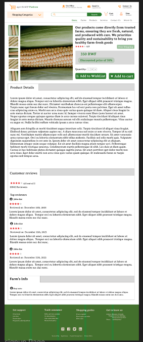
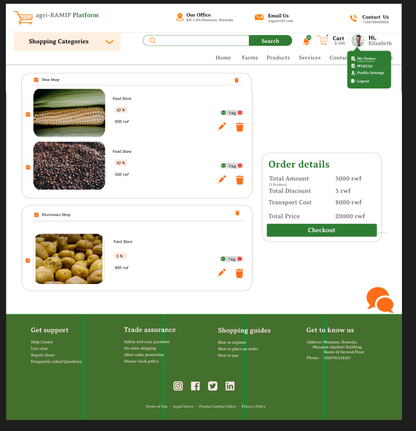
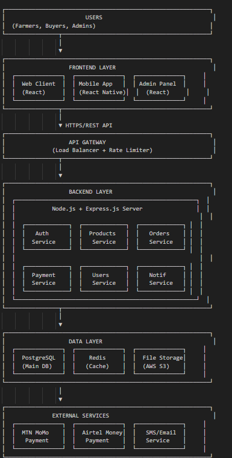

# farm-ramip-platform

## Description
Farm-RAMIP Platform is designed to bridge the gap between Rwanda's agricultural producers and markets by providing a comprehensive digital solution that:

Connects Farmers to Buyers: Direct marketplace access for farmers to list and sell their products
Real-Time Market Information: Up-to-date pricing and demand data
Streamlines Transactions: Secure payment processing and order management
Logistics Integration: Coordination of product delivery and transportation
Market Analytics: Data-driven insights for better decision-making

**Problem Statement**

Local farmers in the northern part of Rwanda face the problem of being unable to sell their products at a reasonable price due to the intervention of numerous middlemen. As a result, they find themselves earning very little, despite being the ones who wait the longest for a return on their labor.
On the other hand, consumers also face problems in the market due to a lack of communication and knowledge about current prices.

**Solution**

Through a digital platform named Farm-RAMIP (Rwanda Agriculture Market Integration Platform). By directly connecting farmers with consumers, Farm-RAMIP will create a more efficient marketplace, leading to competitive prices for buyers, increased income for farmers and transparent communication for all.


**Target Users**


**Farmers:** Small to medium-scale agricultural producers

**Buyers:** Wholesalers, retailers, restaurants, and individual consumers

**Market Administrators:** Platform managers and support staff

**Logistics Providers:** Transportation and delivery services

## Changes made after Defense Panel feedback

After receiving feedback from the defense panel, I made several improvements to enhance both the functionality and documentation of the project. The class diagram, ERD, use case diagram, and architectural diagram were reviewed, corrected, and redesigned to follow proper UML and system design standards. Additionally, broken links—including those pointing to localhost and external unrelated sites—were fixed to ensure smooth navigation and system consistency.

The literature review was also strengthened by incorporating more academic sources and implementation frameworks related to e-commerce systems, stock management, authentication models, and digital agriculture platforms. These updates were made in direct response to the panel’s recommendations and have contributed to a more accurate, structured, and well-justified system.

## GitHub Repository


Repository URL:https://github.com/Idiane05/ramip-farm.git


## How to Set Up Environment & Project

### Dependencies

Node.js (v16 or higher) - Download

npm or yarn - Package manager

Git - Download

PostgreSQL  - Database

VS Code (recommended) - Download

### Installation Steps

#### 1. Clone the repository:

```
git clone https://github.com/Idiane05/ramip-farm.git

cd ramip-farm

```

#### 2. Install Dependencies:

```
npm install

```

#### 3. Create a .env file:

```
cp .env.example .env

```

### Run The Service

#### 1. Start the development server:

```
npm start

```

### Microservices

This frontend application interacts with the following microservices:


**Product Service:** Handles product data.

**User Service:** Manages user authentication and registration.

**Order Service:** Processes orders and manages the shopping cart.


### Testing with Jest

This project uses Jest for unit and integration testing of React components with TypeScript.

#### To run all tests once:

```
npm test

```

#### To run tests in watch mode:

```
npm run test:watch

```

### Project Structure



## Designs

### Figma Mockups


View our complete design system:https://www.figma.com/design/PqkMo3rVikpQkWFIWPZ5iS/Farm-RAMIP?node-id=3101-786&t=PQjhVxbTODG3hwNA-1


#### Key Screens:

**1.Landing Page** - Hero section, features, testimonials

**2.Farmer Dashboard** - Product management, orders, analytics

**3.Buyer Marketplace** - Product browsing, search, filters

**4.Product Details** - Images, description, seller info

**5.Checkout Flow** - Cart, payment, confirmation

**6.User Profile** - Account settings, order history

**7.Admin Panel** - User management, analytics, reports

### Screenshots

#### Landing Page




#### Farmer Dashboard





#### Product Details





#### Checkout Flow




### Circuit Diagram (System Architecture)





### Database Entity Relationship Diagram

View our complete ERD Diagram : https://www.figma.com/board/LG3iNLPKq3GefGvHc5k38P/BackEnd-ERD-?node-id=0-1&p=f&t=o5gVNRndXytCsyju-0

## Deployment Plan

**Phase 1: Development** 

 Set up project structure

 Implement authentication system

 Build core features (product listing, marketplace)

 Integrate payment APIs

 Develop admin panel

 Create mobile app (optional)

**Phase 2: Testing**

 Unit testing (Jest)

 Integration testing

 User acceptance testing 

 Performance testing

 Security audit

**Phase 3: Staging Deployment**

 Deploy to staging environment

 Beta testing with selected farmers and buyers

 Collect feedback and iterate

 Bug fixes and optimizations

**Phase 4: Production Deployment**

Deployment Checklist

**Pre-Deployment:**

 All tests passing

 Code reviewed and approved

 Documentation updated

 Environment variables configured

 Database backups ready

 SSL certificates installed

 Domain DNS configured

Deployment Steps:

1. Frontend Deployment (Vercel/Netlify)

2. Backend Deployment (AWS/Heroku/DigitalOcean)

Option A - Heroku

Option B - AWS EC2

3. Database Deployment

4. Domain & SSL Configuration

**Post-Deployment:**

 Verify all endpoints working

 Test payment integration

 Monitor error logs

 Set up monitoring (Sentry, LogRocket)

 Configure automated backups

 Set up CI/CD pipeline

Monitoring & Maintenance

**Monitoring Tools:**

Uptime: UptimeRobot / Pingdom

Errors: Sentry

Analytics: Google Analytics / Mixpanel

Performance: New Relic / DataDog

Logs: CloudWatch / Papertrail

**Backup Strategy:**

Daily automated database backups

Weekly full system backups

Retention period: 30 days

Backup verification monthly

**Update Schedule:**

Security patches: Immediate

Bug fixes: Weekly

Feature updates: Bi-weekly

Major releases: Monthly


**Scaling Plan**


**Stage 1:** MVP (0-1,000 users)

Single server deployment

Basic monitoring

**Stage 2:** Growth (1,000-10,000 users)

Load balancer

Database read replicas

CDN for static assets

Redis caching

**Stage 3:** Scale (10,000+ users)

Microservices architecture

Container orchestration (Kubernetes)

Multi-region deployment

Advanced caching strategies


# Video Demo

 View my video demo : https://go.screenpal.com/watch/cT6XDdnblrC
